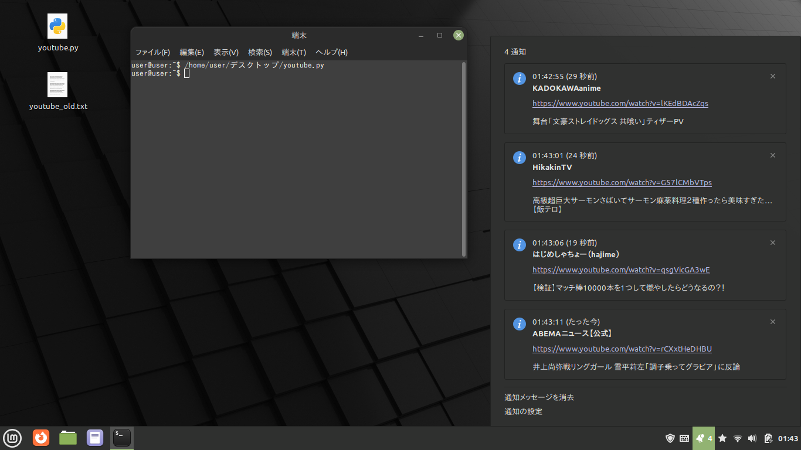

# youtube-notify-send
youtubeのrssから更新情報を取得して[notify-send](https://github.com/GNOME/libnotify)でポップアップ通知をするスクリプトです。

# スクリーンショット

# 説明

変数FAVORITEに一行ずつ`https://www.youtube.com/channel/チャンネルID`で更新を取得したいチャンネルを登録できます。
